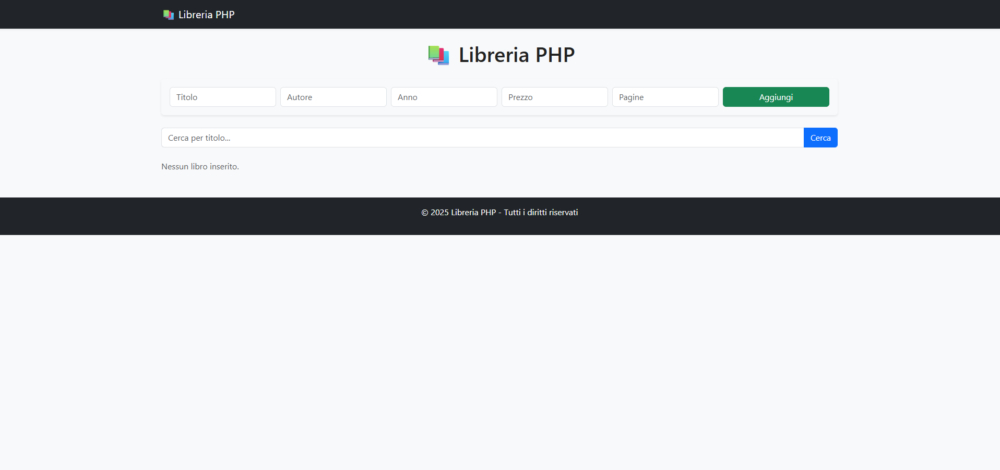
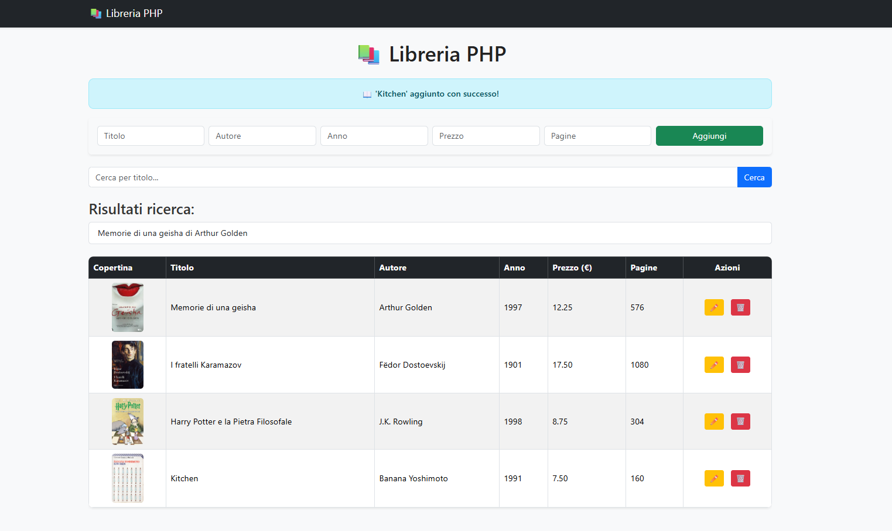
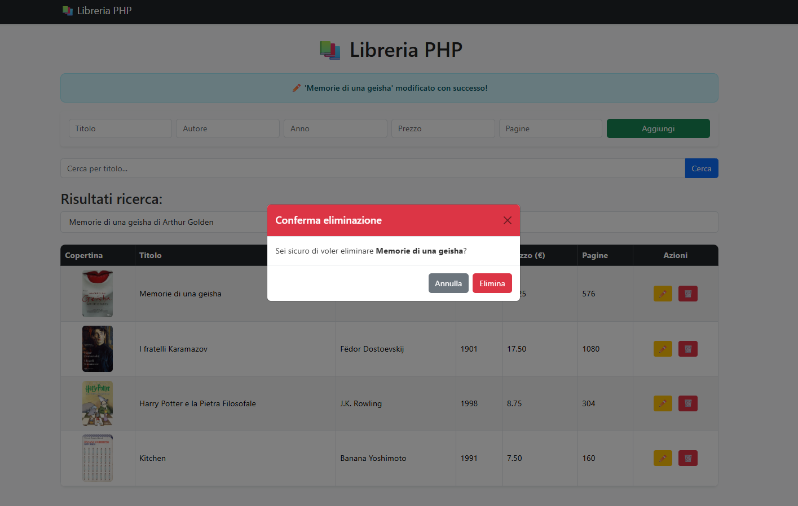

# 📚 Libreria PHP

Applicazione PHP per gestire una libreria personale.  
Permette di **aggiungere**, **visualizzare**, **cercare** **modificare** e **eliminare** libri.  
I dati vengono salvati in **sessione e cookie**.

---
*Novembre 2025*
🧑‍💻
---








---


🔨
| Nome | Linguaggio    | Versione |
|------|------------   |----------|      
| PHP  | backend       | 8.3      |
| XAMPP| Server locale | 8.x      |


👨‍💻
```bash
Avviare XAMPP
Start APACHE SERVER
http://localhost/nomedelfile.php

